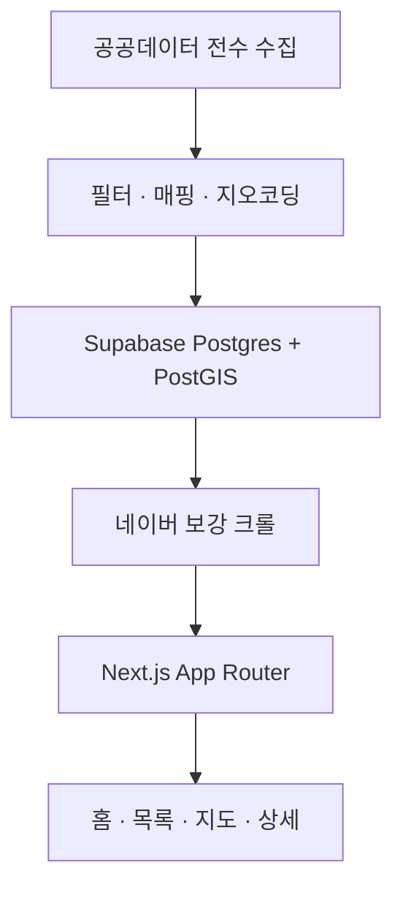

## 제품 소개

전국 목욕탕·찜질방·온천을 온도·세신·24시·노천 같은 축으로 찾는 웹앱이에요.

지도 앱에서 목욕탕을 찾으면 이름이랑 주소, 별점이 나와요. 정작 궁금한 건 그게 아니거든요. 사우나실이 몇 도인지, 냉탕이 있는지, 세신이 되는지, 밤새 있어도 되는지. 그 정보는 어디에도 정리돼 있지 않아서 블로그 후기를 열 개쯤 읽어야 겨우 짐작하게 됩니다.

사우나우는 그 읽는 일을 대신해요. 공공데이터 목욕장업 인허가로 전국 6천여 곳의 바닥을 깔고, 그 위에 영업시간·요금표·사진·후기를 크롤로 얹어서 필터로 좁힐 수 있는 축으로 정리했어요. 지도를 열면 마커가 뜨고, 칩 하나로 "24시 되는 찜질방"만 남길 수 있습니다.

모바일 웹앱이에요. 데스크톱에서는 430px 프레임으로 고정되고, 지도만 풀블리드로 열립니다.

## 기획

**문제** 사우나실이 몇 도인지, 세신이 되는지를 알려면 블로그 후기를 열 개는 읽어야 해요
**사용자** 사우나를 즐겨 다니는 2030. 주말이나 퇴근길에 "지금 갈 만한 곳"을 3탭 안에 찾고 싶어해요
**넣지 않은 것** 예약·결제. 매장 온보딩이 필요한데 혼자 굴리는 서비스라 감당이 안 돼요
**넣지 않은 것** 실시간 혼잡도. 사람이 모여야 나오는 데이터라 지금 만들면 빈 화면이에요
**넣지 않은 것** 자체 지도 타일. 자산은 POI·후기 DB 이지 베이스맵이 아니라고 봤어요

## 유저 플로우

### 홈을 연다

카테고리 카드와 테마 큐레이션이 깔려 있어요. 목적이 뚜렷하면 굳이 안 보고 바로 빠집니다.

**갈라짐** 위치로 찾는다 → 지도 / 조건으로 찾는다 → 목록·필터 / 이름을 안다 → 검색

### 조건으로 좁힌다

지도에서는 상단 칩으로 찜질방·온천·24시를 켜고, 화면을 옮기면 이 지역 다시 검색이 떠요. 목록에서는 필터 시트로 온도 범위랑 세신 여부까지 들어갑니다.

### 매장 상세를 본다

온도·영업시간·요금표·사진·후기·위치가 한 화면에 있어요. 여기까지 오면 갈지 말지가 정해집니다.

**갈라짐** 가볼 만하다 → 찜 / 지금은 아니다 → 뒤로 가서 다시 좁힘

### 다녀와서 남긴다

찜한 곳은 찜 탭에 모이고, 다녀온 곳은 마이의 기록 탭에 메모로 남아요. 로그인해 두면 기기를 바꿔도 따라옵니다.

## 요구사항

- [x] 공공데이터 목욕장업·온천 인허가를 전수 적재하고 매일 동기화한다
- [x] 폐업 전환을 삭제가 아니라 마킹으로 처리해 찜·기록을 보존한다
- [x] PostGIS 로 내 주변 매장을 거리순으로 찾는다
- [x] 지도에서 유형·온도·세신·24시를 칩과 필터 시트로 좁힌다
- [x] 상세에서 온도·영업시간·요금표·사진·후기·위치를 한 화면에 보여준다
- [x] 네이버 업체제공 사진과 블로그 후기를 크롤로 보강한다
- [x] 찜과 기록을 계정에 묶어 기기를 바꿔도 따라오게 한다
- [x] 사용자가 올린 사진을 리사이즈·재인코딩하고 모더레이션을 거쳐 게시한다
- [x] 사진·후기 노출을 재배포 없이 끄는 런타임 킬스위치를 둔다
- [x] 모든 이미지를 자체 Storage 에서만 서빙해 외부 핫링크를 구조적으로 막는다
- [x] 반복 용어마다 전용 일러스트를 두고 화면마다 같게 읽히게 한다
- [x] 카톡·페북 공유 카드와 sitemap·robots 를 코드로 렌더한다
- [ ] 사용자 온도 제보를 모아 표시 임계치를 넘긴다 (현재 제보 0건)
- [ ] 매장 소개문 자동 생성을 전 매장에 적용한다
- [ ] 보강 크롤을 수동 실행에서 자동화로 옮긴다

## 개발 과정

### 1. 먼저 전국을 깔아야 이야기가 됐어요

처음엔 좋은 곳 몇 백 곳만 골라 담을 생각이었어요. 그런데 지도 서비스에서 "내 주변"을 눌렀는데 아무것도 안 뜨면 그 순간 앱이 죽거든요. 커버리지가 먼저였습니다.

그래서 공공데이터포털 목욕장업 인허가를 통째로 받아 왔어요. 영업 상태로 거르고, 상호랑 업태 문자열에서 찜질방·온천·24시를 추론해서 플래그로 심었습니다. 좌표가 아예 없는 행이 1.3% 있어서 그것만 카카오 로컬로 주소 지오코딩을 태웠어요. 주변 검색은 애플리케이션에서 계산하지 않고 PostGIS RPC 하나로 끝냈습니다.

동기화를 붙이면서 한 번 걸렸어요. 폐업으로 바뀐 행을 지우면 거기 매달린 찜이랑 기록이 같이 날아가요. 삭제가 아니라 상태만 바꾸는 쪽으로 갔고, 에디터가 손으로 채운 컬럼은 아예 upsert 매핑에서 빼서 동기화가 덮지 못하게 했습니다.

**붙인 것** 공공데이터포털, 카카오 로컬, Supabase, PostGIS, Vercel

### 2. 온도는 아무도 안 줘요

이 서비스의 이유가 온도인데, 공공데이터에는 그런 컬럼이 없어요. 네이버 지도에도 없고요. 사람들은 그걸 블로그에 씁니다. "사우나실 90도 넘어요" 같은 문장으로요.

네이버 검색 Open API 로 매장 상호를 던져 관련 글만 추렸어요. 본문을 복제하면 안 되니까 제목·발췌·원문 링크·작성일만 저장하고 표시는 링크아웃으로 했습니다. 영업시간이랑 요금표는 검색 API 로는 안 나와서 네이버 플레이스 SSR 페이지를 파싱했어요. 처음엔 정규식으로 긁었는데 favicon 만 나오더라고요. `__APOLLO_STATE__` 를 JSON 으로 파싱하니까 그때부터 제대로 잡혔습니다.

여기서 한참 고쳐 썼어요. 영업시간은 처음에 잡히는 대로 다 넣었는데, 목욕탕 업종은 네이버도 값이 없는 경우가 흔해서 부분 정보를 넣으면 오히려 틀린 정보가 됩니다. 풀 스케줄이 확인될 때만 채우게 바꿨어요. 요금표는 후기 텍스트에서 숫자를 뽑는 파생 스크립트를 따로 뒀고요.

**붙인 것** 네이버 검색 Open API, 네이버 플레이스

### 3. 사진 출처를 두 번 갈아엎었어요

네이버 업체제공 사진을 받으려다 캡차에 막혀서 수집 불가로 결론 내고, Google Places API 로 방향을 틀었어요. 결제까지 붙였습니다.

그런데 구글은 그 사진을 누가 올렸는지 구분할 방법이 없어요. 같은 이름의 카페 사진이 목욕탕 상세에 걸리기 시작했습니다. 두 달쯤 뒤에 네이버 쪽을 다시 봤더니 캡차가 걸린 건 특정 경로였고, 영업시간 때문에 이미 매번 받아오던 페이지 안에 사진 원본 URL 이 그대로 있었어요. mediaSource 로 업체제공·방문자·블로그연동이 갈려서 업체제공만 고를 수도 있었고요. 방문자 사진은 저작자가 개인이라 안 건드렸습니다.

출처를 네이버로 뒤집고 구글 사진을 지웠어요. 이때 원칙 하나를 세웠는데, 어떤 경로로 받았든 이미지는 전부 우리 Storage 에 재호스팅해서 거기서만 서빙합니다. `remotePatterns` 에 제3자 호스트를 아예 등록하지 않아서 외부 핫링크가 구조적으로 불가능해요. 출처랑 원본 URL 은 서버 전용이라 클라이언트로 안 내려갑니다.

**붙인 것** Google Places API, Supabase Storage

### 4. 로그인은 안 넣으려고 했어요

기획할 때 로그인은 비목표였어요. 디바이스 식별로 충분하다고 봤거든요. 찜이랑 메모를 로컬 스토리지에 넣었습니다.

써보니까 폰에서 찜해둔 곳이 노트북에서 안 보여요. 기기를 바꾸면 그냥 사라지고요. 목욕탕은 "다음에 가봐야지" 하고 담아두는 서비스라 이게 치명적이었습니다. Supabase Auth 로 계정을 붙이고 찜·메모를 DB 로 옮겼어요.

옮기고 나서도 손볼 게 남았습니다. 비로그인 상태에서 하트를 누르면 아무 일도 안 일어나는 게 제일 나빴어요. 로그인 시트를 띄워 유도하고, 찜 페이지랑 기록 탭도 비로그인 전용 화면을 따로 그렸습니다. 낙관적 업데이트를 쓰고 있어서 쓰기가 실패하면 상태를 되돌리는 것도 양쪽에 붙였고요.

**붙인 것** Supabase Auth

### 5. UGC 도 안 넣으려고 했는데 열었어요

자유 텍스트 리뷰랑 사진 업로드는 모더레이션 부담 때문에 처음부터 뺐어요. 그런데 크롤로 모은 사진이 매장당 몇 장 안 되는 곳이 꽤 많았습니다. 결국 사진만 열기로 했어요.

혼자 운영하는 서비스라 사람이 검수하는 구조는 못 만듭니다. 그래서 파이프라인 전체를 자동으로 짰어요. 인증 → 킬스위치 → 레이트리밋(1인 1일 10장) → 타입·크기 검증 → sharp 로 EXIF 회전 반영하고 리사이즈해서 WebP 재인코딩 → Vision SafeSearch 모더레이션 → 게시. insert 가 실패하면 이미 올라간 Storage 객체를 롤백합니다.

모더레이션은 페일 클로즈드로 했어요. 키가 없거나 호출이 실패하면 통과가 아니라 거부입니다. 아무도 안 보고 있는 서비스라 미검증 이미지가 공개되는 쪽을 막는 게 맞았어요. 그래도 무언가 새면 재배포 없이 사진·후기 노출을 통째로 끌 수 있게 런타임 킬스위치를 뒀고, 관리자용 사진 관리·신고 처리 화면도 붙였습니다.

**붙인 것** sharp, Google Cloud Vision

### 6. 다 만들고 나니 느렸어요

기능이 붙을수록 화면 전환이 굼떴어요. 특히 지도에서 "내 주변"을 누르면 위치 받고, 데이터 받고, 지도 SDK 받는 게 순서대로 돌아서 몇 초씩 흰 화면이었습니다.

홈·지도·읽을거리를 ISR 로 프리렌더하고, 지도는 셸을 먼저 그린 뒤 캐시된 좌표로 즉시 이동시키면서 데이터랑 SDK 를 병렬로 받게 바꿨어요. 목록은 windowing 을 넣었고, 스켈레톤은 실제 레이아웃과 같은 모양으로 다시 그렸습니다. 모양이 다르면 로딩이 끝나는 순간 화면이 튀어서 오히려 더 느리게 느껴지거든요.

체감을 손보는 작업이 생각보다 길게 이어졌어요. 바텀시트 그랩 히트 영역이 좁아서 잘 안 잡히던 것, 매장을 고르면 좌측 패널에 가려진 위치로 센터링되던 것, 스플래시가 끝나기도 전에 위치 권한 팝업이 뜨던 것까지. 하나씩은 사소한데 모이면 완성도가 갈립니다.

### 7. 아이콘을 직접 그리기 시작했어요

범용 라인 아이콘을 쓰다 보니 목욕탕이랑 찜질방이 구분이 안 됐어요. 둘 다 그냥 물방울이나 건물 모양이 되더라고요. 이 서비스는 용어 자체가 콘텐츠라서 그게 안 읽히면 곤란했습니다.

그래서 반복되는 용어마다 전용 플랫 SVG 를 그려서 한 폴더에 모았어요. 대형 씬이랑 16~20px 칩을 짝으로 만들어서, 같은 용어가 홈에서든 지도에서든 같은 그림으로 읽히게 했습니다. 팔레트는 CSS 토큰 한 곳에서만 고치고요. 칩은 다색이라 `currentColor` 틴트가 안 먹혀서, 활성·비활성 어느 쪽에서도 또렷하게 보이도록 둥근 토큰 배경 위에 얹는 규칙을 따로 뒀어요.

로고까지 갔습니다. 좌상단만 각진 판 모양 마크를 만들어서 앱 아이콘·파비콘·OG·헤더를 전부 교체했어요. OG 이미지는 satori 가 SVG 그라디언트를 못 받아서 div 두 장을 쌓아 같은 그림을 다시 그렸습니다. 마크 색을 바꾸면 두 곳을 같이 고쳐야 하는 부채가 남아 있어요.

### 8. 데이터가 틀린 걸 찾는 게 일이 됐어요

여기서부터는 새 기능보다 데이터 검증 쪽이 대부분이었어요. 헬스장·복지관 부속 목욕시설 189곳이 일반 목욕탕처럼 노출되던 것, 전남·광주 행정통합으로 같은 매장이 두 번 들어온 것, 네이버 매칭이 같은 건물 다른 업소를 잡던 것.

그래서 검증 스크립트를 따로 키웠습니다. Storage 와 DB 정합성을 맞춰보는 감사 스크립트, 고아 객체 정리, 중복 매장 병합, 디렉터리 사이트 후기 제외 같은 것들이요. 판단이 애매한 행은 지우지 않고 `needs_review` 로 적재만 하고 노출에서 뺐어요. 나중에 사람이 볼 수 있게요.

매장 소개문은 Claude Code CLI 를 헤드리스로 돌려서 생성합니다. API 키가 아니라 로그인된 플랜으로 돌아가고, 결과에 코드펜스가 섞여 나와서 JSON 추출을 방어적으로 해뒀어요. 아직 전 매장에 적용하지는 못했습니다.

**붙인 것** Claude Code CLI

## 데이터와 API

### 목욕장업 인허가 (공공데이터)

**제공처** 공공데이터포털 · 행정안전부 목욕장업 정보
**링크** https://apis.data.go.kr/1741000/public_baths/info
**방식** REST · JSON. 증분 파라미터가 없어 매번 전수 스캔
**적재** `pnpm load:initial` 이 전 페이지를 순회해 upsert. 영업 상태로 거르고 상호·업태에서 유형을 추론한 뒤 license_no 를 키로 넣는다
**갱신** Vercel Cron 이 매일 03:00 KST 에 `/api/cron/sync` 호출. 폐업 전환은 삭제가 아니라 상태 변경
**주의** numOfRows 를 1000 으로 요청해도 서버가 100 으로 고정한다. 약 178페이지를 순차 순회. 일일 한도 10,000 콜 안에서 끝난다. 좌표 결측 1.3%

### 온천표준데이터 (공공데이터)

**제공처** 공공데이터포털 · 온천 표준데이터
**링크** https://api.data.go.kr/openapi/tn_pubr_public_hot_spring_api
**방식** REST · JSON. 목욕장업과 별개 도메인
**적재** 전국 18건 정도라 numOfRows=1000 한 콜로 전수
**갱신** 목욕장업과 같은 Cron 안에서 함께 돈다. upsert 뒤 교차링크 RPC 로 온천 인증 플래그를 보강 — 순서가 바뀌면 키워드 재계산이 인증 플래그를 덮는다

### 네이버 검색 Open API (블로그 후기)

**제공처** 네이버 개발자센터
**링크** https://openapi.naver.com/v1/search/blog.json
**방식** REST · JSON. 클라이언트 ID/시크릿 헤더 인증
**적재** `pnpm crawl:naver` 가 상호로 검색해 관련 글만 추린다. 제목·발췌·원문링크·작성일만 저장하고 본문은 복제하지 않는다. 표시는 발췌 + 링크아웃
**갱신** 수동 실행. `--all` `--region` `--refresh` 로 범위 분할
**주의** 무료 쿼터 일 25,000 콜. 상호에 괄호 병기가 있으면 결과가 0건이라 괄호를 떼고 질의한다. 업소 정보를 나열하는 디렉터리 사이트가 후기로 섞여 도메인 차단이 따로 필요했다

### 네이버 플레이스 (영업시간·요금표·업체제공 사진)

**제공처** 네이버 지도 pcmap SSR 페이지. 공식 API 가 아니다
**링크** https://pcmap.place.naver.com/place
**방식** SSR HTML 안의 `__APOLLO_STATE__` 를 JSON 으로 파싱. 정규식으로 긁으면 favicon 만 나온다
**적재** `pnpm crawl:naver-info` 가 영업시간·전화·편의시설·요금표를, `pnpm crawl:naver-photos` 가 업체제공 사진을 받는다. mediaSource 로 업체제공만 고르고 방문자 사진은 건드리지 않는다
**갱신** 수동 실행. 동기화 시각 마커로 이미 시도한 매장을 걸러 중복 조회를 막는다
**주의** 비공식 경로라 구조가 바뀌면 빈 결과를 반환하고 파이프라인을 막지 않게 했다. 요청 속도가 곧 차단이다 — 사진 크롤은 간격 ±40% 지터로 완주했고, 검색+상세로 요청이 2배인 기본정보 크롤은 2,500ms 까지 낮춰야 했다. `/photo` 페이지와 graphql XHR 은 캡차가 걸려 쓰지 않는다

### Google Places API (New)

**제공처** Google Cloud · 결제 활성화 필요
**링크** https://places.googleapis.com/v1/places:searchText
**방식** REST · JSON. searchText 로 매칭한 뒤 photo.name 으로 이미지 바이트 수신
**적재** `pnpm crawl:google`. 미디어 URL 에 API 키가 들어가서 DB 에는 키 없는 photo.name 만 남기고, 받은 바이트는 자체 Storage 에 WebP 로 재호스팅
**갱신** 사실상 중단. 사진 출처를 네이버 업체제공으로 뒤집으며 대체 완료분은 정리
**주의** 업주가 올린 사진인지 구분할 방법이 없다. 동명의 카페·식당 사진이 섞인 게 출처를 바꾼 이유다

### 카카오 로컬 (지오코딩)

**제공처** 카카오 디벨로퍼스
**링크** https://dapi.kakao.com/v2/local/search/address.json
**방식** REST · JSON. REST 키 헤더 인증
**적재** 공공데이터에 좌표가 없는 1.3% 행에만 주소로 폴백 조회
**주의** 키가 없으면 지오코딩 단계만 건너뛰고 나머지 적재는 그대로 돈다

### Google Cloud Vision SafeSearch (사진 모더레이션)

**제공처** Google Cloud
**링크** https://vision.googleapis.com/v1/images:annotate
**방식** REST · JSON. 업로드 사진을 게시 이전에 1회 호출
**적재** adult·violence·racy 가 LIKELY 이상이면 거부
**주의** 페일 클로즈드다. 키가 없거나 호출이 실패하면 통과가 아니라 거부 — 운영자가 개입하지 않는 서비스라 미검증 이미지 공개를 막는 쪽을 택했다

### 네이버 지도 Web Dynamic Map

**제공처** 네이버 클라우드 플랫폼
**방식** 클라이언트 SDK. 베이스맵만 쓰고 마커·후기·사진은 우리 DB 에서 그린다
**주의** 콘솔에 서비스 URL 을 등록해야 키가 동작한다. 키가 없으면 앱은 뜨지만 지도만 안내 상태로 표시된다

### Claude Code CLI (매장 소개문 생성)

**제공처** Anthropic
**방식** `claude -p` 를 헤드리스로 spawn 해 `--output-format json` 결과를 받는다. API 키가 아니라 로그인된 플랜으로 돈다
**적재** `pnpm describe` 가 매장 데이터를 프롬프트로 넘겨 소개문을 받는다
**주의** PATH 에 claude CLI 가 있어야 한다. 결과에 코드펜스가 섞여 나와 JSON 추출을 방어적으로 한다

## 구조

### 공공데이터 전수 수집

목욕장업 인허가와 온천 데이터를 통째로 받아요. 초기 적재 스크립트와 Cron 이 같은 러너를 씁니다.

### 필터 · 매핑 · 지오코딩

영업 상태로 거르고, 상호·업태에서 유형을 추론하고, 좌표가 빠진 행만 지오코딩해요. 판단이 애매한 건 `needs_review` 로 적재만 하고 노출에서 뺍니다.

### Supabase Postgres + PostGIS

매장·온천·후기·사진·찜·메모가 한 DB 에 있어요. 주변 검색은 PostGIS RPC 하나로 끝납니다. 에디터가 손으로 채운 컬럼은 매핑에 없어서 동기화 upsert 가 덮지 않아요.

### 네이버 보강 크롤

영업시간·요금표·편의시설·업체제공 사진·블로그 후기를 별도 스크립트로 채워요. 크롤은 앱 런타임에 없습니다. 전부 수동 실행이고 결과만 DB 에 남아요.

### Next.js App Router

홈·지도·읽을거리를 ISR 로 프리렌더해요. 지도는 셸을 먼저 그리고 데이터와 지도 SDK 를 병렬로 받습니다.

### 홈 · 목록 · 지도 · 상세

같은 데이터를 네 가지 방식으로 열어요. 홈은 큐레이션, 목록은 정렬과 필터, 지도는 위치, 상세는 한 매장 전부.

## 시행착오

### Storage 1.2GB — 무료 한도를 넘긴 게 사진 수가 아니었다

**증상** Supabase Storage 가 1,197MB 로 무료 1GB 를 넘겼다. 사진을 너무 많이 긁었다고 판단했다.

**시도** 오래된 사진을 지우는 정리 스크립트부터 생각했다. 그 전에 실측했더니 블로그 후기 썸네일 10,305개가 버킷의 93% 를 차지하고 있었다. 장수는 문제가 아니었다.

**결론** 썸네일이 화면에서 64px 로만 렌더되는데 갤러리와 같은 720px 규격으로 저장되고 있었다. 용도별 규격(gallery 720px · thumb 160px)을 도입하니 장당 108KB 가 4KB 가 됐다. 고아 객체 3,362개 삭제와 함께 112.7MB 로 떨어졌다. 같은 작업에서 썸네일 Storage 키를 배열 인덱스에서 글 URL 해시로 바꿨다. 재크롤로 글 순서가 바뀌면 같은 경로에 다른 글 이미지가 덮이는 구조였다.

### 썸네일 없는 후기 218건 — 백필하면 10건 중 1건만 성공했다

**증상** 블로그 후기 중 218건에 썸네일이 없었다. og:image 를 다시 긁어오면 될 일로 봤다.

**시도** 백필 스크립트를 돌렸더니 10건 중 1건만 성공했다. 크롤러가 og 태그를 잘못 파싱한다고 의심해 파서를 뜯어봤지만 멀쩡했다.

**결론** 후기가 아니었다. 7,164건을 실측하니 정상 블로그는 og:image 보유율이 92~100% 인데 특정 세 도메인만 0% 였다. 업소 정보를 나열하는 디렉터리 사이트였고, 상호·지역이 정확히 일치해 관련성 필터를 그대로 통과하고 있었다. 필터가 글의 "종류"를 보지 않았다. 도메인 차단을 관련성 판정보다 앞에 두고 기존 110건을 숨겼다. 제외 후 백필 성공률이 10건 중 10건이 된 게 진단의 확증이었다.

### 요금표에 아메리카노 — 좌표와 상호가 맞아도 다른 업소였다

**증상** 강남 목욕장 "나인"의 요금표에 아메리카노가 들어 있었다. 같은 이름의 카페 정보가 통째로 들어와 있었다.

**시도** 처음엔 구글 Places 사진 문제로 보고 사진 출처를 네이버 업체제공 사진으로 바꿨다. 네이버는 mediaSource 로 업체제공을 구분해 주기 때문이다. 사진은 정리됐지만 요금표·영업시간은 계속 틀렸다.

**결론** 업종 검증이 사진 수집 단계에만 걸려 있었다. 매칭 단계는 좌표와 상호만 봤고, 같은 건물의 다른 업소를 막을 수 없었다. placeId 는 저장된 채로 남아 파생 데이터가 계속 그 자리에서 긁혔다. 업종 검증을 별도 모듈로 빼서 매칭 직후에 걸고, 불일치면 placeId 자체를 저장하지 않게 했다. 오매칭 8곳의 파생 데이터를 정리했다.

### 매장 사진은 캡차로 막혔다 — 두 달 뒤 다시 보니 경로가 틀렸다

**증상** 네이버 업체제공 사진을 받으려는데 캡차가 떴다. 수집 불가로 결론 내고 구글 Places 사진을 썼다.

**시도** 두 달 뒤 다시 봤다. 캡차가 걸린 건 `/photo` 페이지와 graphql XHR 경로였다. 영업시간 때문에 이미 매번 받아오던 `/home` SSR 은 캡차 없이 열렸고, 그 안에 사진 원본 URL 이 그대로 있었다. 처음 조사가 원시 HTML 을 정규식으로 긁어 favicon 만 나온 것도 오판에 한몫했다.

**결론** `__APOLLO_STATE__` 를 JSON 으로 파싱해 업체제공 사진만 골라 받았다. 네이버 썸네일이 1,485장에서 1,843장으로 늘고 구글 사진 1,954행을 지워 Storage 94.6MB 를 회수했다. 남은 차단은 코드가 아니라 속도 문제여서, 요청 간격에 ±40% 지터와 백오프를 붙여 차단 0회로 완주했다.

### 재시도 모드 회수율 급락 — 풀이 마른 게 아니었다

**증상** 매칭 실패분 재시도 배치가 1회차엔 200곳 중 20곳을 회수했는데 2회차엔 2곳으로 떨어졌다. 회수할 게 남지 않았다고 읽었다.

**시도** 실제로 잡힌 2곳을 확인해 보니 1회차 이후 새로 들어온 20곳 중 2곳이었다. 회수율은 그대로였다. 나머지 180곳은 방금 실패한 그 매장을 다시 조회한 낭비였다.

**결론** 재시도 대상 조건(동기화 시각 있음 + placeId 없음)에 실패한 행이 그대로 남는데, 정렬을 open_date 순으로 하고 있어 매번 같은 상위 N곳을 뽑았다. 세 경로 모두 동기화 시각을 갱신하므로 가장 오래 전에 시도한 순으로 정렬하면 새 컬럼 없이 풀 전체를 한 바퀴 돈다. 수정 후 드라이런 15곳에서 2곳(13%)으로 1회차 수준에 복귀했다.

### 위치 동의 없이 지도를 열면 시골 매장 한 곳 — 겹친 문제가 넷이었다

**증상** 위치 권한을 주지 않고 지도를 열면 마커 하나뿐인 시골 지도가 떴다. 좌표가 없으면 목록 첫 매장에 줌 13 으로 붙는 코드였다.

**시도** 전국이 들어오도록 fitBounds 로 바꿨다. 줌 9 미만에서 시·도 집계 버블이 뜨는데 그때부터 안 보이던 문제들이 한꺼번에 드러났다. 버블 클릭이 아예 먹지 않았고, 서울·경기 버블이 서로 가려졌고, 버블을 눌러 들어가면 결과가 바텀시트 뒤로 숨었다.

**결론** 클릭이 안 먹은 건 anchor(0,0)에 CSS translate(-50%,-50%)를 겹쳐 네이버가 잡는 마커 박스와 그림이 어긋나 있었기 때문이다. 0×0 래퍼로 감싸 히트 영역을 그림과 맞췄다. 가림은 매장 수로 zIndex 를 주고, 경기도 버블이 서울과 완전히 포개진 건 소속 매장 평균 좌표를 쓴 탓이라 시·도 중심을 도청 소재지 좌표로 고정했다. 바텀시트·좌측 패널을 뺀 보이는 영역 기준으로 fitBounds 한다.

### 온도 남/여 축 — 쪼갠 축이 콜드스타트를 막고 있었다

**증상** 온도 표시가 어느 매장에서도 뜨지 않았다. 표시 임계치는 제보 2건인데 그 문턱을 넘는 매장이 없었다.

**시도** 임계치를 낮추는 쪽을 생각했다. 데이터를 보니 남탕/여탕으로 값이 갈리는 매장이 하나도 없었고 성별 온도 제보도 0건이었다.

**결론** 축을 성별로 쪼개면 필요한 제보가 두 배(2건 × 성별 × 지표)가 된다. 아무도 안 쓰는 구분 때문에 문턱만 두 배가 돼 있었다. 표시·수집 모두 단일 축으로 통합하고, 값이 없을 때 90°/20° 를 하드코딩하던 것도 같이 걷어냈다. 추정치를 실측처럼 보이게 하던 문제였다. gender 컬럼은 nullable 로 DB 에 남겨 복원 여지를 뒀다.

## 남은 것

- 온도 제보가 0건이다. 표시 임계치를 넘기려면 제보 동선을 다시 설계해야 한다.
- 매장 소개문 자동 생성이 일부 매장에만 적용돼 있다.
- 보강 크롤이 전부 수동 실행이다. 자동화하려면 차단 내성을 지금보다 더 확보해야 한다.
- 요금표 정확도가 출처에 따라 갈린다. 후기 텍스트에서 뽑은 값은 오래된 경우가 있다.
- 사진 모더레이션이 업로드 시점 1회다. 사후 신고 처리는 관리자 수동이다.
- 로고 마크 색을 바꾸면 SVG 와 OG 렌더 두 곳을 같이 고쳐야 한다.
